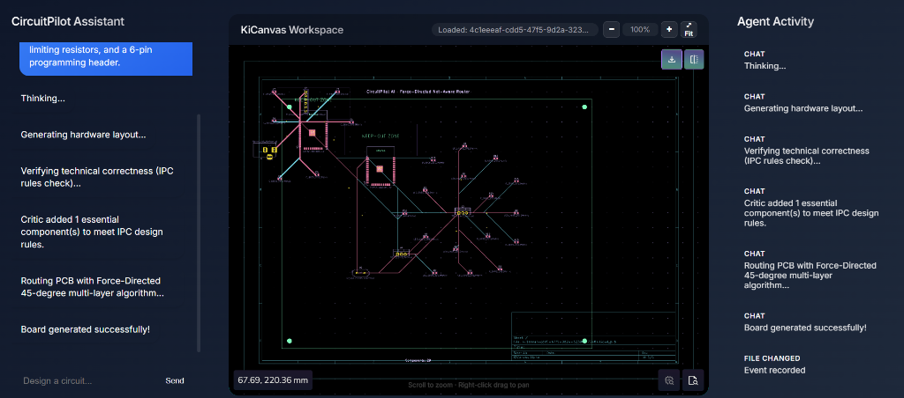
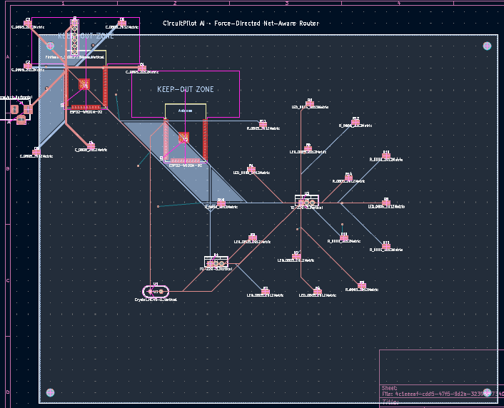
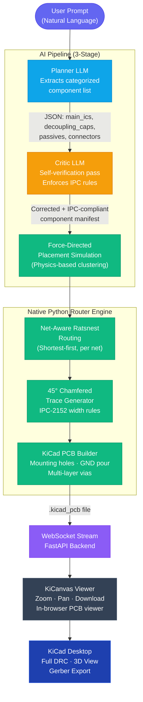

<div align="center">
  

  <h1>CircuitPilot</h1>
  <p><strong>Expert AI-Powered PCB Design · From Prompt to Physical Board</strong></p>

  <p>
    
    
    
    
    
    
  </p>
  
  <p>
    <a href="https://github.com/Paramveersingh-S/CircuitPilot/stargazers"></a>
    <a href="https://github.com/Paramveersingh-S/CircuitPilot/fork"></a>
    <a href="https://github.com/Paramveersingh-S/CircuitPilot/blob/main/LICENSE"></a>
    <a href="https://x.com/ParamveerS15896"></a>
  </p>
</div>

<br />

## Overview

**Stop manually placing components for simple IoT boards. Let physics and AI do it in seconds.**

**CircuitPilot** is an open-source AI agent that translates natural language into production-ready KiCad PCB layouts using a multi-stage pipeline. Unlike wrappers that just output text, CircuitPilot includes a custom built **Force-Directed Physics Router** to generate expert-quality boards with 45-degree multi-layer trace routing.

👉 **[Read the Deep Dive: How the Force-Directed Physics Router Works](ARCHITECTURE.md)**

### Application

<div align="center">
  
  <p><em>CircuitPilot UI — AI Chat, IPC Critic verification, real-time KiCanvas board viewer with zoom/pan controls.</em></p>
</div>

### PCB Output Example (KiCad Desktop)

<div align="center">
  
  <p><em>AI-generated PCB opened in KiCad — Force-Directed Net-Aware routing with 45-degree chamfers, multi-layer vias, copper ground pour, and M3 mounting holes. Generated entirely from a single text prompt.</em></p>
</div>

---

## How It Works



---

## Features

- **Prompt-to-PCB in seconds**: Describe any circuit in plain English, get a physical board
- **LLM Self-Verification (Critic)**: A second AI pass enforces IPC design rules before routing — adds missing decoupling caps, crystal oscillators, resistors for LEDs automatically
- **Force-Directed Physics Placement**: Components cluster organically by electrical connectivity, not rigid grids
- **Net-Aware Ratsnest Routing**: Routes shortest connections first per net, like a real EDA tool
- **IPC-2152 Trace Widths**: Power nets routed at 0.8mm, signal nets at 0.25mm automatically
- **Multi-Layer Routing**: Automatically switches between F.Cu and B.Cu with drill vias
- **DFM Edge Clearances**: 15mm margins enforced from board edge (fabrication safe)
- **Provider-Agnostic AI**: Switch between OpenAI, Gemini, Anthropic, or local Ollama via `.env`
- **Interactive KiCanvas Viewer**: Zoom, pan, and inspect the board before downloading

---

## Architecture

### Tech Stack

| Layer | Technology |
|-------|-----------|
| Frontend | React 18, Vite, TypeScript, KiCanvas |
| Backend | Python 3.11, FastAPI, WebSockets |
| AI Layer | LiteLLM (OpenAI / Gemini / Anthropic / Ollama) |
| PCB Router | Custom Native Python Engine (Force-Directed + Net-Aware) |
| Containerization | Docker, Docker Compose |
| PCB Format | KiCad 10 `.kicad_pcb` |

---

## Quick Start (Zero Friction)

The easiest way to run CircuitPilot is via Docker. You just need an LLM API key (OpenAI, Gemini, Anthropic, etc).

```bash
git clone https://github.com/Paramveersingh-S/CircuitPilot.git
cd CircuitPilot/backend
cp .env.example .env 
# Add your OPENAI_API_KEY to .env, then run:
cd .. && docker-compose up --build
```
Then open `http://localhost:5173` in your browser!

---

## Local Development Setup

### Prerequisites

- **Node.js** (v18+)
- **Python** (v3.11+)
- An LLM API key

### 1. Configure Environment

```bash
cd backend
cp .env.example .env
# Edit .env:
# OPENAI_API_KEY=your_key
# LLM_MODEL=openai/gpt-4o          # or gemini/gemini-2.0-flash
# OPENAI_API_BASE=http://localhost:11434  # for Ollama
```

### 2. Start the Backend

```bash
cd backend
python -m venv venv311
.\venv311\Scripts\Activate.ps1   # Windows
pip install -r requirements.txt
python -m uvicorn app.main:app --reload --port 8000
```

### 3. Start the Frontend

```bash
cd frontend
npm install
npm run dev
```

### 4. Docker (Full Stack)

```bash
docker compose up --build
```

---

## Usage

1. Navigate to `http://localhost:5173/`
2. Describe your circuit in the Chat Panel
3. Watch: **Planner** extracts components → **Critic** verifies IPC rules → **Router** generates the board
4. Use **Scroll** to zoom and **Right-click drag** to pan the board in the browser
5. Download the `.kicad_pcb` file and open in KiCad Desktop for full DRC + 3D view + Gerber export
