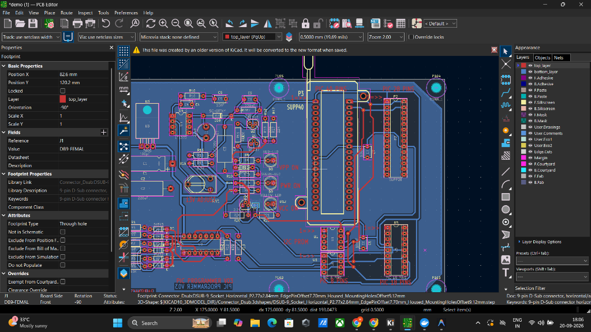
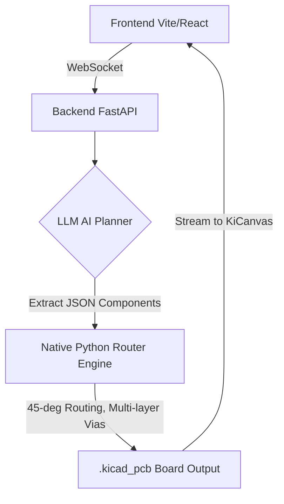

<div align="center">
  

  <h1>CircuitPilot</h1>
  <p><strong>Expert AI-Powered PCB Design Software</strong></p>

  <p>
    
    
    
    
    
    
  </p>
</div>

<br />

## Overview

**CircuitPilot** is an advanced AI agent application that translates natural language prompts into physical Printed Circuit Boards (PCBs). 

<div align="center">
  
  <p><em>Example of a generated multi-layer PCB with copper pours, vias, and expert routing.</em></p>
</div>

By leveraging the power of Large Language Models connected natively to the **Atopile** hardware compiler and the **KiCad** physical routing engine via an isolated Docker environment, CircuitPilot enables users to simply describe a circuit (e.g., *"Design a PIC Microcontroller board with a 12V barrel jack, a 5V TO-220 regulator, and 4 status LEDs"*) and instantly receive a fully valid `.kicad_pcb` file mapped to real physical footprints and topological nets.

---

## Features

- **Prompt-to-PCB**: Seamless natural language synthesis of hardware layouts.
- **True Hardware Compilation**: Uses Atopile (`.ato`) syntax generation to electrically verify nets, define module constraints, and enforce DRC rules.
- **Dockerized Environment**: The entire hardware compilation suite (C++ build tools, KiCad, Atopile) runs completely isolated inside a Linux Docker container, bypassing complex Windows installation constraints.
- **Interactive UI**: A sleek, dark-mode GUI featuring an AI Chat Panel, an Activity Feed, and an embedded KiCanvas interactive PCB viewer.

---

## Architecture



1. **Frontend (Vite / React)**: Handles user interaction, chat websockets, and displays the generated KiCad board using KiCanvas.
2. **Backend (FastAPI)**: Manages sessions, Git-backed workspaces, and routes prompts to the LLM.
3. **Planner Agent (LLM)**: An AI configured with strict compiler rules that synthesizes valid Atopile (`.ato`) hardware code.
4. **Atopile Docker Runner**: The generated `.ato` code is mounted into a Linux container where `ato build` generates the physical footprint placement and netlist export.

---

## Running Instructions

### Prerequisites

- **Node.js** (v18+)
- **Python** (v3.11+)
- **Docker Desktop** (Must be running for the hardware compiler to function)

### 1. Start the Backend

The backend manages the AI generation, workspaces, and Docker orchestration.

```bash
cd backend
python -m venv venv311
.\venv311\Scripts\Activate.ps1
pip install -r requirements.txt

# Start the FastAPI server
python -m uvicorn app.main:app --reload --port 8000
```

### 2. Start the Frontend

The frontend hosts the CircuitPilot UI and KiCanvas integration.

```bash
cd frontend
npm install

# Start the Vite development server
npm run dev
```

### 3. Build the Hardware Compiler Image

Ensure Docker Desktop is running, then build the isolated compiler image. This image contains KiCad, CMake, and Atopile.

```bash
cd backend/atopile_docker
docker build -t atopile-runner .
```

---

## Usage

1. Navigate to `http://localhost:5173/` in your browser.
2. Enter a prompt into the Chat Panel describing the board you want to build.
3. Watch the AI write the Atopile code, and the Docker container compile it natively.
4. The interactive `.kicad_pcb` board will stream directly into your canvas!
