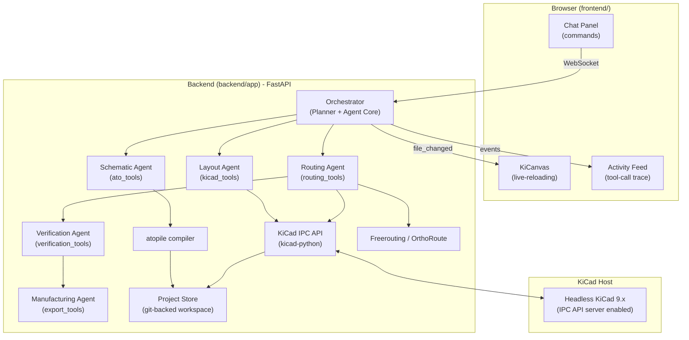

# CircuitPilot 🚀

[](https://fastapi.tiangolo.com/)
[](https://reactjs.org/)
[](https://www.kicad.org/)
[](https://atopile.io/)

**CircuitPilot** is an AI-Enabled Real-Time PCB Design Copilot.

Unlike typical chatbots, CircuitPilot directly edits a real, DRC-checked KiCad project through the same engine a human PCB designer uses, using the new KiCad 9 IPC API and `atopile` for declarative circuit constraints.

## System Architecture



## Features

- **Schematic Copilot**: Natural language translation into `atopile` `.ato` code for schematic generation.
- **Layout Copilot**: Auto-placement heuristics and manual layout adjustments via AI.
- **Routing Copilot**: Deep integration with external autorouters like Freerouting or OrthoRoute and KiCad interactive router.
- **Manufacturing Export**: Automated DFM checks and one-click Gerber/BOM/CPL generation.

## Getting Started

Run the full stack via Docker Compose:
```bash
docker-compose up --build
```
Open `http://localhost:5173` to view the UI.
